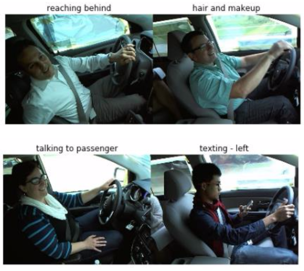
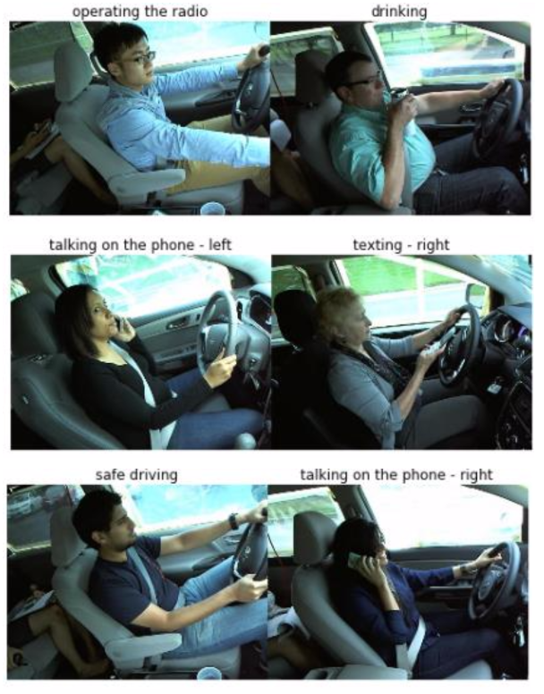

# Distracted_Driver_Detection


We've all been there: a light turns green and the car in front of you doesn't budge. 
Or, a previously unremarkable vehicle suddenly slows and starts swerving from side-to-side.

When you pass the offending driver, what do you expect to see? 
You certainly aren't surprised when you spot a driver who is texting, seemingly enraptured by social media,
or in a lively hand-held conversation on their phone.


The 10 classes to predict are:

- c0: normal driving
- c1: texting - right
- c2: talking on the phone - right
- c3: texting - left
- c4: talking on the phone - left
- c5: operating the radio
- c6: drinking
- c7: reaching behind
- c8: hair and makeup
- c9: talking to passenger




### Dependency

The main Python packages:
- [Opencv](http://opencv.org/)
- [NumPy](http://www.numpy.org/)
- [TensorFlow](http://tensorflow.org)
- [Keras](https://keras.io)

The running environment is [Jupyter Notebook](https://jupyter.org/install.html).

### Data

The dataset is provided by [Kaggle State Farm](https://www.kaggle.com/c/state-farm-distracted-driver-detection/submissions?sortBy=date&group=successful&page=1). You can down load the dataset after creating an ancount.

The directory should be name as "capserver". Under this directory, there should be three folders: "data", "cache", "subm". 

The "data" folder is used for the dataset. The cache is created for the storage of the weights and data. And the submission file ".csv" will be created in the subm folder.

### Run

In the command line, make sure the you are in the "capserver" folder, then run the command as below:

```bash
jupyter notebook final.ipynb
```

It will start the jupyter notebook and open the project file in your browser 

The total running time will be around 12 hours in the AWS server P2.xlarge. The running result can be seen in the .ipynb file.

### Application

The real-time camera application is built in .py file.
